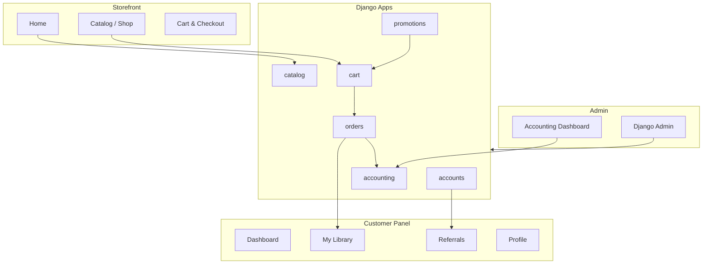

# DigitalShop

A scalable Django e-commerce platform for **digital products** — e-books, courses, templates, tools, and more. No shipping, instant delivery, and a modern dark-themed storefront built for growth.

---

## Table of Contents

- [Features](#features)
- [Tech Stack](#tech-stack)
- [Architecture](#architecture)
- [Project Structure](#project-structure)
- [Database Design](#database-design)
- [Getting Started](#getting-started)
- [Demo Accounts](#demo-accounts)
- [URL Reference](#url-reference)
- [How It Works](#how-it-works)
- [Admin & Management](#admin--management)
- [Extending the Project](#extending-the-project)
- [Production Checklist](#production-checklist)

---

## Features

### Storefront
- Product catalog with **categories**, search, and sorting
- Product detail pages with pricing, sale badges, and file listings
- Responsive dark UI with a cohesive design system

### Shopping & Checkout
- Session-based cart for guests; persistent cart for logged-in users
- Cart merge on login/register
- **Coupon codes** (percentage or fixed discount)
- **Referral credit** applied at checkout
- Simulated payment flow with instant order completion

### Customer Panel
- Dashboard with order history and stats
- **My Library** — download purchased digital assets anytime
- Profile management (name, email, phone, avatar)
- **Referral program** — share a link, earn 5% credit on friend purchases

### Admin & Accounting
- Full **Django Admin** for all models
- Custom **Accounting Dashboard** — revenue, transactions, monthly charts, top coupons

### Security
- Session authentication with **httpOnly cookies**
- CSRF protection with httpOnly CSRF cookies
- Download access restricted to purchasers (or staff)

---

## Tech Stack

| Layer        | Technology                          |
| ------------ | ----------------------------------- |
| Framework    | Django 6.x                          |
| Database     | SQLite (`db.sqlite3`)               |
| Templates    | Django Templates                    |
| Styling      | Custom CSS (DM Sans + Instrument Serif) |
| Images       | Pillow                              |
| Python       | 3.10+ recommended                   |

---

## Architecture

The codebase is split into **independent Django apps** under `apps/`. Each app owns its models, views, admin, and URLs. Business logic lives in **service modules**, not views — making it easy to add payment gateways, APIs, or new features later.



### App Responsibilities

| App           | Purpose                                              |
| ------------- | ---------------------------------------------------- |
| `accounts`    | User profiles, referral codes, referral rewards      |
| `catalog`     | Categories, products, digital asset files            |
| `cart`        | Shopping cart, coupon session, checkout views        |
| `orders`      | Orders, order items, user library, checkout service  |
| `promotions`  | Coupon definitions and usage tracking                |
| `accounting`  | Financial transactions and admin revenue dashboard   |
| `core`        | Shared mixins and abstract base models               |

---

## Project Structure

```
django-test/
├── config/                  # Project settings & root URLs
│   ├── settings.py
│   └── urls.py
├── apps/
│   ├── accounts/            # Auth, profiles, referrals
│   ├── catalog/             # Products & categories
│   ├── cart/                # Cart & checkout UI
│   ├── orders/              # Orders, library, CheckoutService
│   ├── promotions/          # Coupons
│   ├── accounting/          # Transactions & admin dashboard
│   ├── core/                # TimeStampedModel, AdminRequiredMixin
│   └── storefront_urls.py   # Homepage routes
├── templates/               # Global templates & components
├── static/
│   ├── css/main.css
│   └── js/main.js
├── media/                   # Uploaded product files & covers
├── manage.py
├── db.sqlite3
└── requirements.txt
```

---

## Database Design

Each domain has its own tables with explicit `db_table` names for clarity and future migrations.

| Table                    | App          | Description                              |
| ------------------------ | ------------ | ---------------------------------------- |
| `accounts_profile`       | accounts     | User profile, referral code, credit      |
| `accounts_referral_reward` | accounts   | Referral payout records                  |
| `catalog_category`       | catalog      | Product categories                       |
| `catalog_product`        | catalog      | Digital products with pricing            |
| `catalog_digital_asset`  | catalog      | Downloadable files per product           |
| `cart_cart`              | cart         | Cart (user or session)                   |
| `cart_cart_item`         | cart         | Line items in cart                       |
| `orders_order`           | orders       | Completed/pending orders                 |
| `orders_order_item`      | orders       | Snapshot of items at purchase time       |
| `orders_user_library`    | orders       | Purchased products & download tracking   |
| `promotions_coupon`      | promotions   | Coupon rules and limits                  |
| `promotions_coupon_usage`| promotions   | Per-order coupon redemption              |
| `accounting_transaction` | accounting   | Sale, refund, referral payout records    |

---

## Getting Started

### Prerequisites

- Python 3.10 or higher
- `pip` and `venv`

### 1. Clone & enter the project

```bash
cd django-test
```

### 2. Create and activate a virtual environment

```bash
python -m venv venv
source venv/bin/activate        # macOS / Linux
# venv\Scripts\activate         # Windows
```

### 3. Install dependencies

```bash
pip install -r requirements.txt
```

### 4. Run migrations

```bash
python manage.py migrate
```

### 5. Seed sample data (optional)

Populates categories, products, coupons, and demo users:

```bash
python manage.py seed_data
```

### 6. Start the development server

```bash
python manage.py runserver
```

Open **http://127.0.0.1:8000/** in your browser.

### Create your own superuser

```bash
python manage.py createsuperuser
```

---

## Demo Accounts

Available after running `seed_data`:

| Role     | Username | Password   | Access                                      |
| -------- | -------- | ---------- | ------------------------------------------- |
| Admin    | `admin`  | `admin123` | Django Admin + Accounting Dashboard         |
| Customer | `demo`   | `demo123`  | Shop, cart, library, referrals              |

### Sample coupon codes

| Code        | Type       | Value | Notes                    |
| ----------- | ---------- | ----- | ------------------------ |
| `WELCOME10` | Percentage | 10%   | Welcome discount         |
| `SAVE20`    | Fixed      | $20   | Min order $50            |
| `FLASH50`   | Percentage | 50%   | Limited to 100 uses      |

---

## URL Reference

### Public

| URL                        | Description              |
| -------------------------- | ------------------------ |
| `/`                        | Homepage                 |
| `/shop/products/`          | All products             |
| `/shop/category/<slug>/`   | Products by category     |
| `/shop/product/<slug>/`    | Product detail           |
| `/shop/categories/`        | Category listing         |
| `/cart/`                   | Shopping cart            |
| `/accounts/login/`         | Sign in                  |
| `/accounts/register/`      | Create account           |

### Customer (login required)

| URL                        | Description              |
| -------------------------- | ------------------------ |
| `/accounts/dashboard/`     | Customer dashboard       |
| `/accounts/library/`       | Purchased downloads      |
| `/accounts/referrals/`     | Referral program         |
| `/accounts/profile/`       | Profile settings         |
| `/cart/checkout/`          | Checkout                 |
| `/orders/`                 | Order history            |
| `/orders/<order_number>/`  | Order detail             |
| `/orders/download/<id>/`   | Download digital asset   |

### Admin (staff required)

| URL                              | Description              |
| -------------------------------- | ------------------------ |
| `/admin/`                        | Django Admin panel       |
| `/admin-panel/accounting/`       | Accounting dashboard     |

---

## How It Works

### Authentication (httpOnly cookies)

Authentication uses Django's **session framework**. Session and CSRF cookies are configured as httpOnly in `config/settings.py`:

```python
SESSION_COOKIE_HTTPONLY = True
CSRF_COOKIE_HTTPONLY = True
```

This keeps session tokens out of JavaScript reach, reducing XSS risk.

### Checkout flow

1. Customer adds products to cart
2. Optional: apply coupon (stored in session)
3. At checkout: `CheckoutService.process_order()` runs inside a DB transaction
4. Order + order items + library entries are created
5. Coupon usage and referral rewards are recorded
6. Accounting transaction is logged
7. Cart is cleared

Key service: `apps/orders/services.py` → `CheckoutService`

### Referral system

- Every user gets a unique **referral code** on registration (`accounts_profile.referral_code`)
- New users can enter a code at signup, or visit `/accounts/register/?ref=CODE`
- When a referred user completes a purchase, the referrer receives **5% store credit**
- Credit can be applied at checkout via the "Use referral credit" checkbox

### Digital delivery

After a successful order, products appear in **My Library** (`orders_user_library`). Each `DigitalAsset` linked to the product can be downloaded via a protected view that verifies ownership.

---

## Admin & Management

### Django Admin (`/admin/`)

Manage everything from one place:

- **Catalog** — categories, products, digital asset files, cover images
- **Promotions** — create/edit coupons with usage limits and expiry
- **Orders** — view and update order status
- **Accounting** — browse transaction history
- **Users** — manage accounts; profile and referral code shown inline

### Accounting Dashboard (`/admin-panel/accounting/`)

Staff-only custom dashboard showing:

- Total and monthly revenue
- Average order value
- Recent transactions
- Monthly revenue bars
- Top coupon usage
- Recent orders

### Re-seed demo data

```bash
python manage.py seed_data
```

Safe to re-run — uses `get_or_create` for categories, products, and coupons.

---

## Extending the Project

The modular layout is designed so new features slot in without rewriting existing code.

### Add a new app

```bash
python manage.py startapp my_feature apps/my_feature
```

Register it in `config/settings.py` → `INSTALLED_APPS`, then add URLs to `config/urls.py`.

### Suggested future modules

| Feature            | Suggested approach                                      |
| ------------------ | ------------------------------------------------------- |
| Real payments      | New `payments` app; hook into `CheckoutService`         |
| REST API           | Add Django REST Framework; reuse existing services      |
| Subscriptions      | New `subscriptions` app linked to `orders`              |
| Email notifications| Django signals on order completion in `orders` app        |
| Reviews & ratings  | New `reviews` app with FK to `catalog.Product`          |
| Wishlists          | New `wishlists` app or extend `cart`                    |

### Conventions to follow

- Put business logic in **`services.py`**, not views
- Use **`TimeStampedModel`** from `apps/core/models.py` for new models
- Set explicit **`db_table`** names on model `Meta` classes
- Keep templates in `templates/<app_name>/`
- Use **`AdminRequiredMixin`** from `apps/core/mixins.py` for staff views

---

## Production Checklist

Before deploying, update `config/settings.py`:

- [ ] Set `DEBUG = False`
- [ ] Configure `ALLOWED_HOSTS`
- [ ] Use environment variables for `SECRET_KEY`
- [ ] Set `SESSION_COOKIE_SECURE = True` (HTTPS only)
- [ ] Set `CSRF_COOKIE_SECURE = True`
- [ ] Run `python manage.py collectstatic`
- [ ] Use a production database (PostgreSQL recommended)
- [ ] Serve media files via object storage (S3, etc.)
- [ ] Replace simulated checkout with a real payment provider

---

## License

This project is provided as-is for development and learning purposes.
